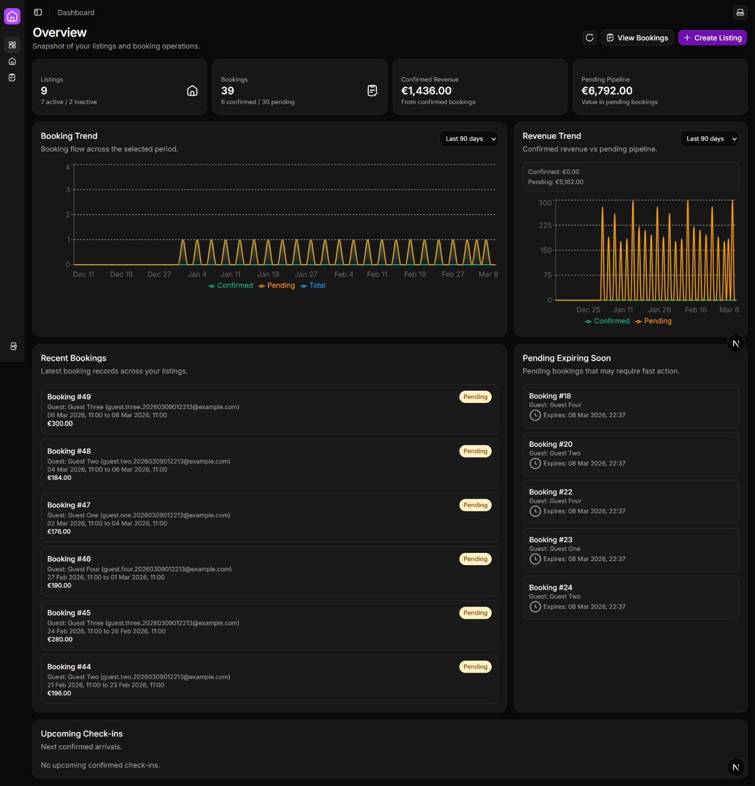
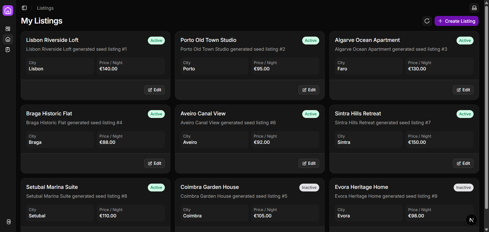
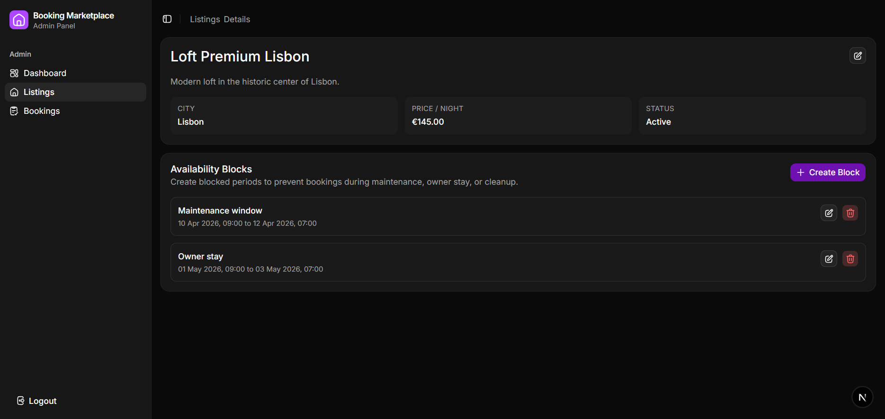
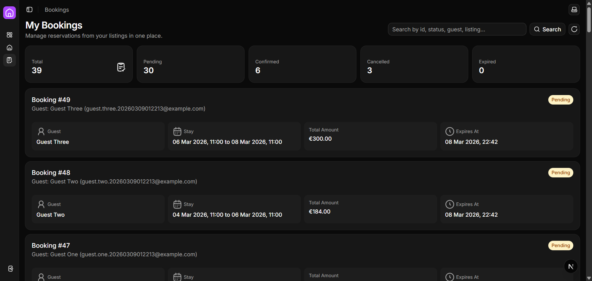

# Booking Marketplace

A full-stack booking marketplace monorepo with a NestJS API and a Next.js admin frontend.

This project currently focuses on the **host/admin workflow**: managing listings, availability blocks, and bookings with operational dashboards and filters.

## Monorepo Structure

```text
booking-marketplace/
  backend/     # NestJS API (PostgreSQL + Redis + BullMQ)
  frontend/    # Next.js app (admin-first UI)
  docs/        # Technical and functional documentation
  media/       # Screenshot examples
```

## Core Features

- JWT authentication with refresh-token cookie flow
- Listing CRUD for hosts
- Availability block CRUD with overlap protection
- Booking lifecycle (`pending`, `confirmed`, `cancelled`, `expired`)
- Booking confirmation protected by transaction + pessimistic locking
- Host-only bookings visibility with search support on backend
- Admin dashboard with KPI cards and booking/revenue charts
- Sidebar navigation with collapsible persistence and active-route highlighting
- Dark/light/system theme toggle

## Technology Stack

### Frontend

- Next.js (App Router) + React 19 + TypeScript
- Tailwind CSS v4 + shadcn/ui + Radix UI primitives
- React Query (`@tanstack/react-query`) for server state
- React Hook Form + schema resolver validation
- Zustand for auth state
- date-fns for date formatting
- Recharts for dashboard charts
- next-themes for theme switching

### Backend

- NestJS 11 + TypeScript
- TypeORM + PostgreSQL
- Redis + BullMQ (background expiration jobs)
- class-validator + class-transformer
- Swagger (`/docs`) for API docs
- Jest (unit and e2e tests)

## API Highlights

Base API has **no global `/api` prefix**.

Main route groups:
- `/auth`
- `/listings`
- `/availabilityblocks`
- `/bookings`
- `/health`

Swagger:
- `GET /docs`

## Frontend Route Highlights

- Public auth:
  - `/auth/login`
  - `/auth/signup`
- Protected admin:
  - `/admin/dashboard`
  - `/admin/listings`
  - `/admin/listings/new`
  - `/admin/listings/[id]/edit`
  - `/listings/[id]` (listing details + availability blocks)
  - `/admin/bookings`

## Local Development

## Prerequisites

- Node.js 22+
- pnpm 10+
- PostgreSQL
- Redis

## Install

```bash
pnpm install
```

## Run both apps

```bash
pnpm dev
```

## Run individually

```bash
pnpm dev:backend
pnpm dev:frontend
```

Default URLs:
- Frontend: `http://localhost:3000`
- Backend: `http://localhost:3001`
- Swagger: `http://localhost:3001/docs`

## Backend Environment

Use `backend/.env.example` as reference.

Important variables:
- `PORT`
- `DB_HOST`, `DB_PORT`, `DB_USER`, `DB_PASSWORD`, `DB_NAME`
- `REDIS_HOST`, `REDIS_PORT`
- `JWT_ACCESS_SECRET`, `JWT_REFRESH_SECRET`
- `JWT_ACCESS_EXPIRES`, `JWT_REFRESH_EXPIRES`
- `CORS_ORIGIN`

## Docker Compose

The repository includes `docker-compose.yml` with:
- `frontend`
- `backend`
- `postgres`
- `redis`

Start with:

```bash
docker compose up --build
```

## Testing and Lint

From repository root:

```bash
pnpm lint
pnpm test
pnpm test:e2e
```

Backend-only examples:

```bash
pnpm --filter @booking-marketplace/backend test
pnpm --filter @booking-marketplace/backend test:e2e
```

## Documentation

Backend docs:
- `docs/backend/overview.md`
- `docs/backend/api-endpoints.md`
- `docs/backend/data-model.md`
- `docs/backend/users-bookings-seed.md`

Frontend docs:
- `docs/frontend/admin/overview.md`
- `docs/frontend/admin/folder-structure.md`
- `docs/frontend/client/overview.md`
- `docs/frontend/client/folder-structure.md`
- `docs/frontend/libraries-and-examples.md`

## Admin Pages (with examples)

### Dashboard (`/admin/dashboard`)

The dashboard gives hosts an operational overview with KPI cards, booking trend chart, revenue trend chart, and quick booking panels (recent bookings, pending expirations, upcoming check-ins).



### My Listings (`/admin/listings`)

This page lists all host listings with status and pricing data, supports quick navigation to listing details, and provides shortcuts for creating and editing listings.



### Listing Details (`/admin/listings/[id]`)

The listing details page shows listing metadata and full availability-block management, including create/edit modals and delete confirmation.



### My Bookings (`/admin/bookings`)

Bookings are shown with host-level visibility and operational filters (status, guest, listing), including status summaries and booking cards with stay/payment/expiration details.



## Current Product Scope

This version is admin-first. Client/public marketplace features are intentionally minimal and centered on authentication entry points.
